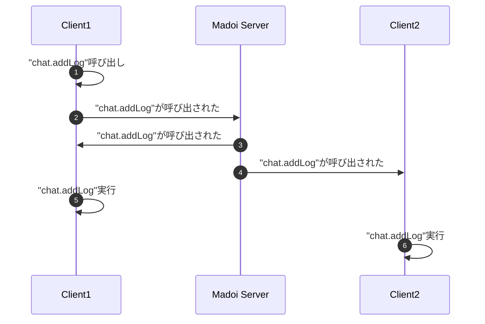
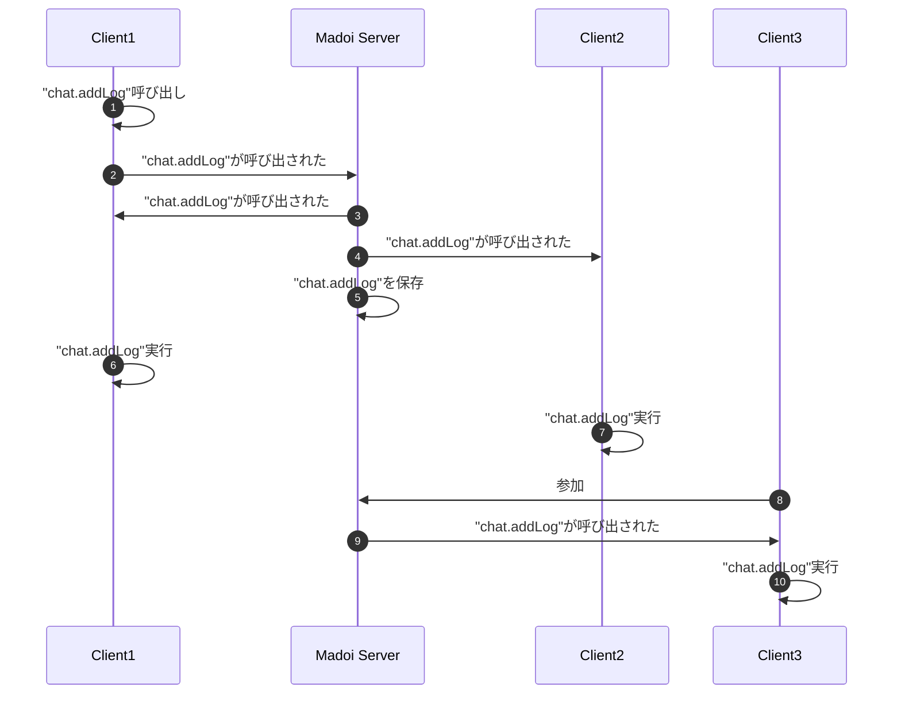

# madoi-sample-js-chat

未来環境ラボで開発しているオブジェクト共有サービス Madoi を使ってチャットを作成するサンプルです。Madoiを利用すると，簡単なコードでチャットやホワイトボードなどのネットワークアプリケーションを開発できます。

サンプルを実行するには，まずこのリポジトリをcloneしてください。
```
git clone https://github.com/kcg-edu-future-lab/madoi-sample-js-chat
```

次に keys.js.sample をコピーして keys.js を作成し、適切に設定を行なってください。

```ts
// Madoi設定
const madoiUrl = "http://localhost:8080/madoi";
const madoiKey = "MADOI_API_KEY";
```

MadoiサーバのデフォルトのMADOI_API_KEYは、[docker-compose.yml](https://github.com/kcg-edu-future-lab/madoi/blob/master/docker-compose.yml)を参照してください。

次にindex.htmlがあるディレクトリでHTTPサーバを起動し，ブラウザで表示してください。例えばpython3がインストールされていれば，以下のコマンドでサーバを起動できます。Rubyや他の言語でもHTTPサーバを起動できるものはありますので，環境に応じた方法で起動してください。
```
python3 -m http.server 8080
```

ブラウザで http://localhost:8080 を開き，表示された画面のテキストフィールドにメッセージを入力してEnterを押すか送信ボタンを押すと，チャットメッセージが送信されます。


## コードの説明

このサンプル([ソースコード](https://github.com/kcg-edu-future-lab/madoi-sample-js-chat/blob/main/index.html))では，まずチャットの入力フォームとログを表示するdivタグを定義しています。該当部分を引用します。

```html
<form id="chatForm">
    <input data-id="name" size="8" type="text" value="匿名">
    <input data-id="message" size="20" type="text" placeholder="送信するメッセージ">
    <button type="submit">送信</button>
</form>
<div id="chatLogDiv">
    <template data-id="logTemplate">
        <span data-id="name"></span>: <span data-id="message"></span><br/>
    </template>
</div>
```

フォームでは，名前とメッセージを入力するinputと，送信ボタンが定義されています。ログ部分は，ログとして追加するHTMLのテンプレートが定義されています。メッセージが追加されるたびに，このテンプレートを複製してログ用のdivに追加します。

以下に，JavaScript部分の冒頭を引用します。

```js
window.addEventListener("load", ()=>{
    const m = new madoi.Madoi("chat-ldfngslkkeg", madoiKey);  // (a)
    const chat = new Chat("chatForm", "chatLogDiv");  // (b)
    m.register(chat, [  // (c)
        {method: chat.addLog, distributed: {}, changeState: {}}
    ]);
});
```

ページがロードされると，Madoiクラスをnewしています`(a)`。引数はルームのIDとアクセスキーです。同じルームIDを指定しているクライアント間で，メッセージ配信が行われます。次にChatクラスをnewして`(c)`，addLogメソッドをMadoiに登録しています`(c)`。メソッドをMadoiに登録すると，そのメソッドの実行が，同じルームに参加しているクライアント間で共有されます。

具体的には，addLogメソッドが呼び出されると，まず呼び出されたという通知がMadoiサーバに送信されます(メソッドの中身はまだ実行されません)。Madoiサーバはルームに参加している前クライアントにその通知を送ります。クライアントが通知を受け取ると，実際にメソッドが実行されます。この仕組みにより，全てのChatアプリケーションに名前とメッセージが送信され，ログに追加されます。



また，`(c)`でaddLogメソッドを登録した際に，`distributed: {}, changeState: {}`という，2つの空オブジェクトを渡しています。前者は，メソッドの実行を他のクライアントにも配信することを示し，後者はメソッドの実行が状態変更を起こすことを示します。この2つの指定を行うと，メソッド実行時にサーバにもメソッド名やパラメータが送信され，サーバに記録され，他のクライアントに配信され，メソッドが実行されます。新しいクライアントが参加してきた時に，サーバに記録されているメソッド実行記録が渡され，メソッドが実行されます。この仕組みにより，途中からクライアントが参加しても，チャットログの状態が最新に追いつきます。




最後に，ChatクラスのaddLogメソッドを以下に引用します。

```js
class Chat{
    // 省略
    addLog(name, message){
        const log = this.logTemplate.content.cloneNode(true);
        log.querySelector("[data-id='name']").textContent = name;
        log.querySelector("[data-id='message']").textContent = message;
        this.chatLogDiv.append(log);
        this.chatLogDiv.scrollTop = this.chatLogDiv.scrollHeight;
    }
}
```

このメソッドでは，名前(name)とメッセージ(message)を受け取り，ログのテンプレートを複製してnameとmessageを設定し，チャットログに追加しています。このメソッドが全クライアントで実行されることで，ログ部分の状態が共有されます。

